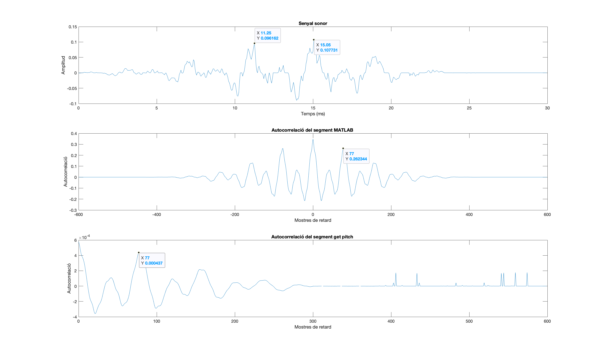
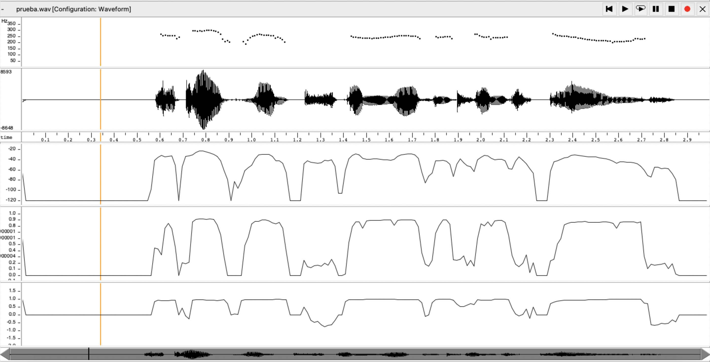
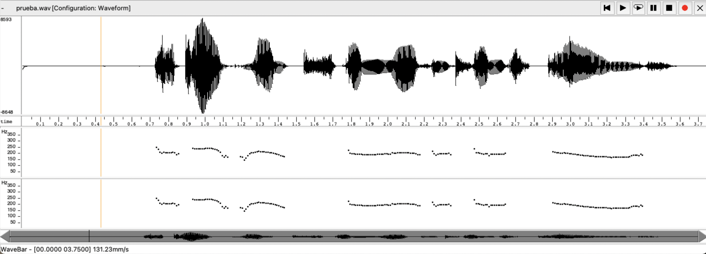
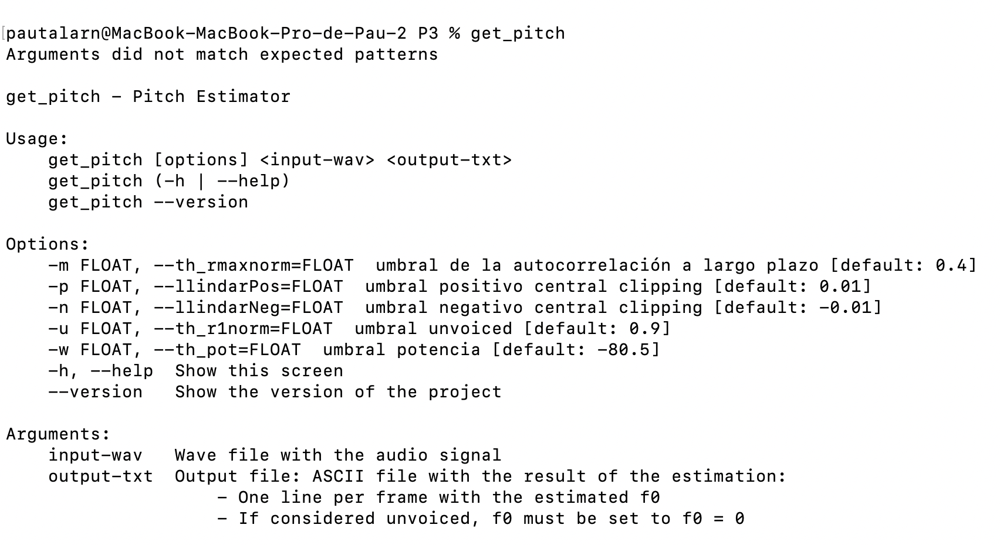
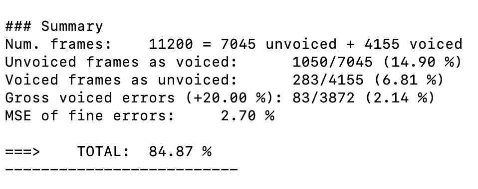
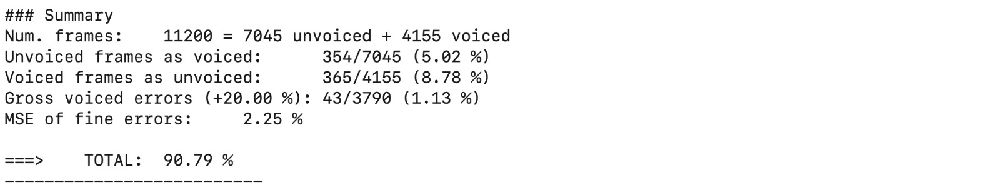
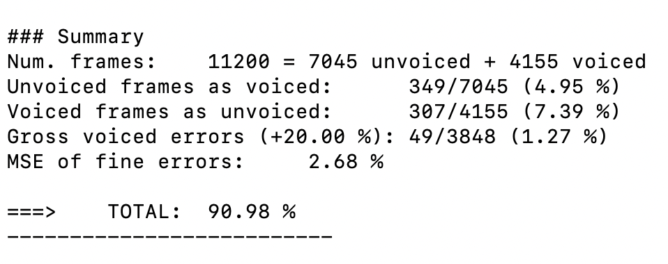
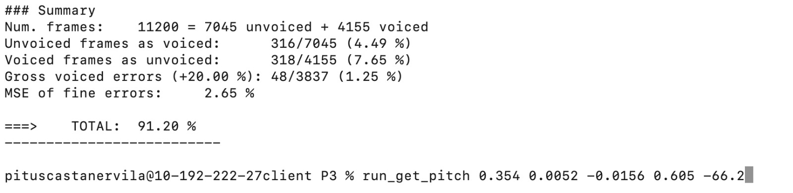

PAV - P3: estimación de pitch
=============================

Esta práctica se distribuye a través del repositorio GitHub [Práctica 3](https://github.com/albino-pav/P3).
Siga las instrucciones de la [Práctica 2](https://github.com/albino-pav/P2) para realizar un `fork` de la
misma y distribuir copias locales (*clones*) del mismo a los distintos integrantes del grupo de prácticas.

Recuerde realizar el *pull request* al repositorio original una vez completada la práctica.

Ejercicios básicos
------------------

- Complete el código de los ficheros necesarios para realizar la estimación de pitch usando el programa
  `get_pitch`.
  
ma
   * Complete el cálculo de la autocorrelación e inserte a continuación el código correspondiente.

    ```
    void PitchAnalyzer::autocorrelation(const vector<float> &x, vector<float> &r) const {

    for (unsigned int l = 0; l < r.size(); ++l) {
      r[l] = 0;
      for(unsigned int n = l; n < x.size(); n++){
        r[l] += x[n]*x[n-l];
      }
      r[l] /= x.size();
    }

    if (r[0] == 0.0F) 
      r[0] = 1e-12; 
  }
    ```


   * Inserte una gŕafica donde, en un *subplot*, se vea con claridad la señal temporal de un segmento de
     unos 30 ms de un fonema sonoro y su periodo de pitch; y, en otro *subplot*, se vea con claridad la
	 autocorrelación de la señal y la posición del primer máximo secundario.

   A continuació es mostra el senyal temporal d'un dels primers fonemes sonors del fitxer `prueba.wav`. La segona gràfica 
   es correspon a l'autocorrelació del segment utilitzant la funció `xcorr(data)`de MATLAB. La tercera és l'autocorrelació
   que ha realitzat el nostra programa amb el codi anterior.


   

	 NOTA: es más que probable que tenga que usar Python, Octave/MATLAB u otro programa semejante para
	 hacerlo. Se valorará la utilización de la biblioteca matplotlib de Python.

   * Determine el mejor candidato para el periodo de pitch localizando el primer máximo secundario de la
     autocorrelación. Inserte a continuación el código correspondiente.

     En el senyal temporal observem que el període és de 3,8 ms, que es correspon a un freqüència de 263 Hz.
     El segon màxim de l'autocorrelació és un desplaçament de 77 mostres (fm=20000), que es correspon a a una freqüència de 263 Hz.
      ```
      % Llegim l'arxiu voiced_x.txt
      filename = 'voiced_x.txt';
      data = dlmread(filename);

      filename2 = 'voiced_r.txt';
      data_autocorr = dlmread(filename2);

      % Definim la freqüència de mostreig
      fs = 20000;

      % Vector temps
      t = ((0:length(data)-1)/fs)*1000;

      % Senyal temporal
      subplot(3,1,1);
      plot(t, data);
      xlabel('Temps (ms)');
      ylabel('Amplitud');
      title('Senyal sonor');

      % Autocorrelació
      [r, lags] = xcorr(data);

      % Gràfic autocorrelació Matlab
      subplot(3,1,2);
      plot(lags, r);
      xlabel('Mostres de retard');
      ylabel('Autocorrelació');
      title('Autocorrelació del segment MATLAB ');

      %vector data autocorr

      lags_pos=0:length(data_autocorr)-1;

      % Gràfic autocorrelació
      subplot(3,1,3);
      plot(lags_pos, data_autocorr);
      xlabel('Mostres de retard');
      ylabel('Autocorrelació');
      title('Autocorrelació del segment get pitch ');
     ```

   * Implemente la regla de decisión sonoro o sordo e inserte el código correspondiente.

   ```
    if (rmaxnorm > th_rmaxnorm && r1norm > th_r1norm && pot > th_pot)
        {
          return false;
        }

        return true;
  ```

   * Puede serle útil seguir las instrucciones contenidas en el documento adjunto `código.pdf`.

- Una vez completados los puntos anteriores, dispondrá de una primera versión del estimador de pitch. El 
  resto del trabajo consiste, básicamente, en obtener las mejores prestaciones posibles con él.

  * Utilice el programa `wavesurfer` para analizar las condiciones apropiadas para determinar si un
    segmento es sonoro o sordo. 
	
	  - Inserte una gráfica con la estimación de pitch incorporada a `wavesurfer` y, junto a ella, los 
	    principales candidatos para determinar la sonoridad de la voz: el nivel de potencia de la señal
		(r[0]), la autocorrelación normalizada de uno (r1norm = r[1] / r[0]) y el valor de la
		autocorrelación en su máximo secundario (rmaxnorm = r[lag] / r[0]).
    En la imatge s'hi representen 5 gràfiques: 
      1er: estimació del pitch del wavesurfer
      2na: senyal temporal
      3era: potència
      4rta: autocorrelació en el seu màxim secundari (rmaxnorm = r[lag] / r[0])
      5ena: autocorrelació normalitzada de un (r1norm = r[1] / r[0])

      

		Puede considerar, también, la conveniencia de usar la tasa de cruces por cero.

	    Recuerde configurar los paneles de datos para que el desplazamiento de ventana sea el adecuado, que
		en esta práctica es de 15 ms.

      - Use el estimador de pitch implementado en el programa `wavesurfer` en una señal de prueba y compare
	    su resultado con el obtenido por la mejor versión de su propio sistema.  Inserte una gráfica
		ilustrativa del resultado de ambos estimadores.
    L'evaluació del resultat del pitch del àudio prueba.wav té una avaluació del 92.20% segons el pitch_evaluate. 
    En aquest cas estem comparant el resultat del nostra programa i l'estimació del pitch del `wavesurfer`i observem que
    les diferències son molt poc apreciables. La primera estimació del pitch es correspon amb l'output del programa i la segona
    gràfica és l'estimació del `wavesurfer`.


    


     
		Aunque puede usar el propio Wavesurfer para obtener la representación, se valorará
	 	el uso de alternativas de mayor calidad (particularmente Python).
  
  * Optimice los parámetros de su sistema de estimación de pitch e inserte una tabla con las tasas de error
    y el *score* TOTAL proporcionados por `pitch_evaluate` en la evaluación de la base de datos 
	`pitch_db/train`..

Ejercicios de ampliación
------------------------

- Usando la librería `docopt_cpp`, modifique el fichero `get_pitch.cpp` para incorporar los parámetros del
  estimador a los argumentos de la línea de comandos.
  
  Esta técnica le resultará especialmente útil para optimizar los parámetros del estimador. Recuerde que
  una parte importante de la evaluación recaerá en el resultado obtenido en la estimación de pitch en la
  base de datos.

  * Inserte un *pantallazo* en el que se vea el mensaje de ayuda del programa y un ejemplo de utilización
    con los argumentos añadidos.

  

  Podem observar que s'han afegit diferents paràmetres per tal que l'usuari pugui modificar per teclat i trobar el valor òptim.

  Per una banda, tenim en primer lloc un conjunt d'umbrals que ens ajuden a decidir si la trama que estem revent és sonora o no per tal de buscar-li el pitch o no:

  * -m th_rmaxnorm --> Si r[log]/r[0] és més gran que el llindar establert , podem determinar que la senyal és periòdica i, petr tant, sonora.

  * -u th_r1norm --> Si r[1]/r[0] és més gran que el llindar establert  també es pot identificar la trama com a sonora.

  * -w th_pot --> A més a a més una trama sonora té una potència suficient gran i major que la que ens marca el llindar.

 Pot ser que hi hagi alguna excepció en aquestes condicions i, per tant, si no s'acompleixen totes, podrem afirmar que el so no és sonor.

  A més a més, s'ha implementat un preprocessat center-clipping. Per tant, cal posar uns umbrals on "retallar la senyal". Aquests venen donats per l'usuari a -p (llindarPos) i -n (llindarNeg).
  
- Implemente las técnicas que considere oportunas para optimizar las prestaciones del sistema de estimación
  de pitch.

  Entre las posibles mejoras, puede escoger una o más de las siguientes:

  * Técnicas de preprocesado: filtrado paso bajo, diezmado, *center clipping*, etc.
  * Técnicas de postprocesado: filtro de mediana, *dynamic time warping*, etc.
  * Métodos alternativos a la autocorrelación: procesado cepstral, *average magnitude difference function*
    (AMDF), etc.
  * Optimización **demostrable** de los parámetros que gobiernan el estimador, en concreto, de los que
    gobiernan la decisión sonoro/sordo.
  * Cualquier otra técnica que se le pueda ocurrir o encuentre en la literatura.

   Per tal de poder estimar el pitch i obtenir un millor resultat s'ha realitzat diferents tècniques de preproccessat, processat i postprocessat. 

**Preprocessat**

En primer lloc s'ha implementat un central-clipping per tal d'eliminar soroll a petita escala que pugui aparèixer a la senyal. S'ha implementat a partir dels paràmetres passats per l'usuari (llindarPos i llindarNeg).   
```
 for(unsigned int k=0; k<x.size();k++){ //Anem des de 0 fins al tamany de la funció x
    if(x[k]>0){ //Si l'element en la posició k és més gran que 0
      x[k]=x[k]-llindarPos; //Li treiem a la funció llindarPos per aplicar el central-clipping
      if(x[k]<0){ // Si el resultat de la resta és més petit que 0 pose el nou valor a 0
        x[k]=0;
      }
    } else { //Apliquem el mateix que abans però per números positius
      x[k]=x[k]-llindarNeg;
      if(x[k]>0){
        x[k]=0;
      }
    }
  }
  ```




 Podem observar com en el primer cas tenim una senyal  on no s'ha aplicat el central clipping i en el segon cas sí que s'ha aplicat amb els valors: 0.0052  i -0.0156. És observable com treure soroll de fons amb els paràmetres adecuats produeix una millora important.

**Postptocessat**

A més a més s'ha aplicat una tècnica de postptocessat aplicant la tècnica de la mitjana. Aquesta tècnica és molt important per evitar salts de pitch estranys i evitar la duplicació i reducció a la mitad de falses deteccions. El sistema intenta estimar la mostra a partir de les mostes veïnes del punt en què estem agafant un valor intermig. En aquest cas estem agafant un vector en què s'analitza la mostra anterior a l'actual i dos més de superiors per tal d'aplicar el filtre de mijana. El codi és el següent:
````
vector<float> vect_Med;  // es declara un vector buit de tipus float anomenat vect_Med
vector<float> vect_f0;   // es declara un vector buit de tipus float anomenat vect_f0
vect_f0.push_back(f0[0]); // s'afegeix el primer element del vector f0 al vector vect_f0   
for (unsigned int l=1; l<f0.size()-1; l++){  // es recorre des del segon element fins al penúltim element del vector f0
    for(int r=-1; r<2; r++){  // es recorre els veïns de l'element actual de f0
      vect_Med.push_back(f0[l+r]);  // s'afegeix l'element actual de f0 i els seus veïns al vector vect_Med
    sort(vect_Med.begin(),vect_Med.end());  // s'ordena el vector vect_Med en ordre ascendent
    vect_f0.push_back(vect_Med[1]); // s'agafa l'element 1 del vect_Med al vector vect_f0 com la mitjana dels tres elements
    vect_Med.clear(); // es netegen els elements del vector vect_Med per a la següent iteració
  }
vect_f0.push_back(f0[f0.size()-1]); // s'afegeix l'últim element de f0 al vector vect_f0

````
A continuació es podrà obsevrar la millora important de posar o no el postprocessat:





**Hamming**

A més a més, s'ha canviat el tipus de finestra permetent que l'usuari pugui triar si realitzar-ho amb Hamming o amb una finestra recta. Podem observar com s'utlitza la fórmula de la finestra de Hamming i com, depenent del paràmetre que l'usuari vulgui passar s'aplica Hamming o la finestra ja donada. Per tal d'implementar aquesta funció s'ha aplicat:

```
 window.resize(frameLen);

    switch (win_type)
    {
    case HAMMING:
      for (unsigned int n = 0; n < frameLen; n++)
      {
        window[n] = 0.53836 - (0.46164 * (cos((2 * 3.1416 * n) / (frameLen - 1))));
      }

      break;
    case RECT:
    default:
      window.assign(frameLen, 1);
  ```
Malgrat aquest fet, el fet d'aplicar la finestra de Hamming no modifica en absolut el resultat final:




Hem deixat però al codi la implementació d'aquest ja que forma part del procès experimental.

**Recerca dels umbrals òptims**

Finalment, també s'ha aplicat un optimitzador d'ubmrals de manera que es puiguin millorar al màxim les prestacions dels umbrals establerts. Dins del fitxer optim.sh hem creat diferents bucles amb diferents rangs de valors (uns per cada llindar a estudiar) i es fa la comparació (run_get_pitch) a cada iteració fins trobar el millors valors de cada paràmetre que passa l'usuari. 

```
for th_rmaxnorm in $(seq 0.354 0.001 0.356); do
    for llindarPos in $(seq 0.0051 0.0001 0.0055 ); do
        for llindarNeg in $(seq -0.0154 -0.0001 -0.0157 ); do
            for th_r1norm in $(seq 0.691 0.001 0.695 ); do
                    echo -n "th_rmaxnorm=$th_rmaxnorm llindarPos=$llindarPos llindarNeg=$llindarNeg th_r1norm=$th_r1norm th_pot=-66"
                    scripts/run_get_pitch.sh $th_rmaxnorm $llindarPos $llindarNeg $th_r1norm -66  > /dev/null
                    pitch_evaluate pitch_db/train/*.f0ref | fgrep TOTAL   
            done
        done 
    done
done | sort -t: -k 2n;
exit 0

````

Tenint en consideració tots els resultat obtinguts i amb els valor òptims trobats podem afirmar que a millor estimació del pitch ens dona:




Evaluación *ciega* del estimador
-------------------------------

Antes de realizar el *pull request* debe asegurarse de que su repositorio contiene los ficheros necesarios
para compilar los programas correctamente ejecutando `make release`.

Con los ejecutables construidos de esta manera, los profesores de la asignatura procederán a evaluar el
estimador con la parte de test de la base de datos (desconocida para los alumnos). Una parte importante de
la nota de la práctica recaerá en el resultado de esta evaluación.
